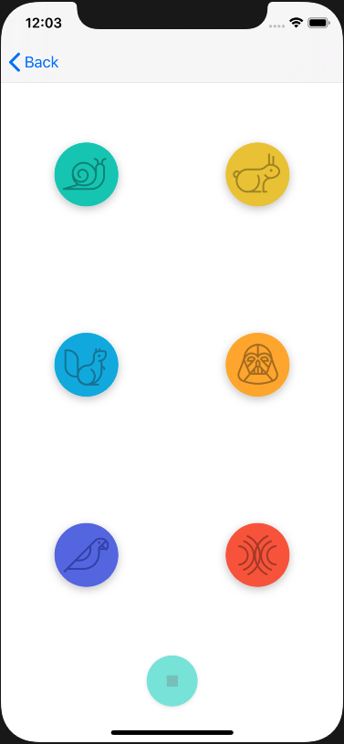

# PitchPerfect
> Voice Recording App

[![Swift Version][swift-image]][swift-url]
[![License][license-image]][license-url]

This is simple voice-changing app that records a user's audio using the microphone and plays the user's voice back. The user 6 options to choose from.



## Requirements 
- iOS 13.5+
- Xcode 9.3+

## Installation
1. Download and drop ```PitchPerfect.swift``` in your project.  

[swift-image]:https://img.shields.io/badge/swift-5.0-orange.svg
[swift-url]: https://swift.org/
[license-image]: https://img.shields.io/badge/License-MIT-blue.svg
[license-url]: https://opensource.org/licenses/MIT

